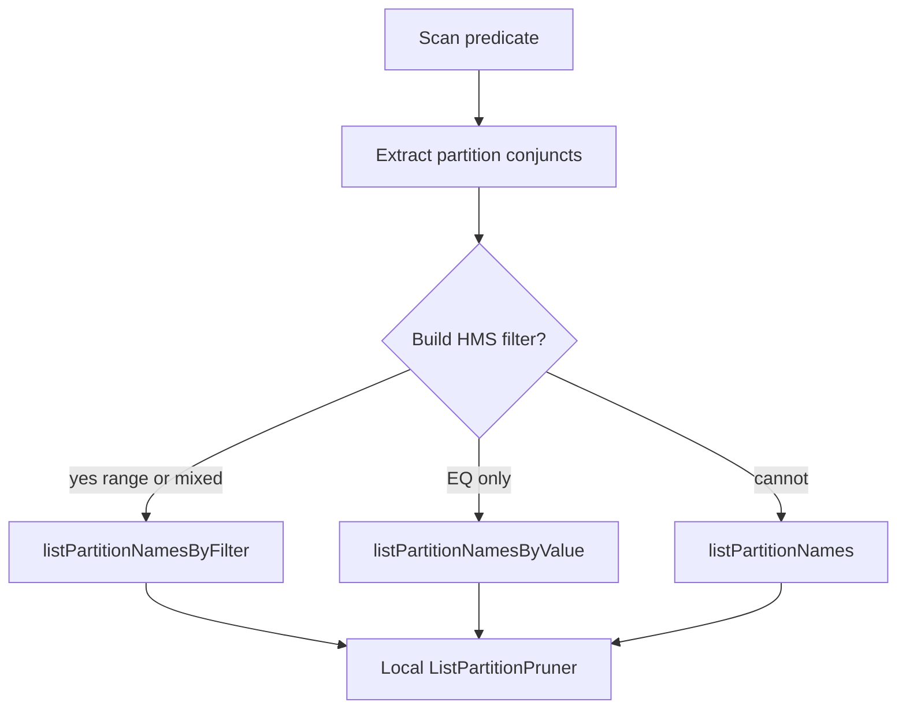

# HMS listPartitionsByFilter 分区裁剪

## 背景与目标

当前 [`OptExternalPartitionPruner.getEffectivePartitionPredicate`](fe/fe-core/src/main/java/com/starrocks/sql/optimizer/rewrite/OptExternalPartitionPruner.java) **只认 `column = constant`**，再走 `listPartitionNamesByValue`。

因此：

```sql
dayno >= '20260726' AND dayno <= '20260726'
```

不会下推 → 全量 `listPartitionNames` → 多级分区表（如 `dc_iot_dw.dwd_ow_uni_channel_inc_h` 约 2.5 万分区）触发 `hive.metastore.limit.partition.request=10000`。

选定方案：**对接 HMS `listPartitionsByFilter`**（对齐 Trino/Hive），用 filter 字符串下推范围谓词。



## 实现要点

### 1. 补齐普通 HMS 客户端（阻塞项）

[`HiveMetaStoreClient.listPartitionsByFilter`](fe/fe-core/src/main/java/org/apache/hadoop/hive/metastore/HiveMetaStoreClient.java) 当前直接 `throw TException("method not implemented")`。

改为 thrift 调用（与现有 `get_partition_names` 同风格）：

```java
return client.get_partitions_by_filter(dbName, tblName, filter, shrinkMaxtoShort(maxParts));
```

Glue/DLF 已有可用实现，可复用 short 重载；catalog 重载不必依赖。

### 2. 元数据调用链新增 `listPartitionNamesByFilter`

贯穿（默认实现安全回退到全量 `listPartitionNames`，禁止返回空列表）：

- [`ConnectorMetadata`](fe/fe-core/src/main/java/com/starrocks/connector/ConnectorMetadata.java)
- [`MetadataMgr`](fe/fe-core/src/main/java/com/starrocks/server/MetadataMgr.java)
- [`CatalogConnectorMetadata`](fe/fe-core/src/main/java/com/starrocks/connector/CatalogConnectorMetadata.java) / [`UnifiedMetadata`](fe/fe-core/src/main/java/com/starrocks/connector/unified/UnifiedMetadata.java)
- Hive：[`HiveMetadata`](fe/fe-core/src/main/java/com/starrocks/connector/hive/HiveMetadata.java) → [`HiveMetastoreOperations`](fe/fe-core/src/main/java/com/starrocks/connector/hive/HiveMetastoreOperations.java) → [`IHiveMetastore`](fe/fe-core/src/main/java/com/starrocks/connector/hive/IHiveMetastore.java) → [`HiveMetastore`](fe/fe-core/src/main/java/com/starrocks/connector/hive/HiveMetastore.java) → [`HiveMetaClient`](fe/fe-core/src/main/java/com/starrocks/connector/hive/HiveMetaClient.java)
- [`CachingHiveMetastore`](fe/fe-core/src/main/java/com/starrocks/connector/hive/CachingHiveMetastore.java)：第一版 **不缓存** filter 结果（避免高基数），仅代理到底层

`HiveMetaClient` 反射调用 `listPartitionsByFilter(db, table, filter, (short)-1)`，把返回的 `Partition.getValues()` 用表分区列名转成 `dayno=.../hour=...`（`PartitionUtil.toHivePartitionName` / `Warehouse.makePartName`）。

### 3. 谓词 → HMS filter 字符串

在 `OptExternalPartitionPruner` 新增构建器（可参考 Glue [`ExpressionHelper`](fe/fe-core/src/main/java/com/starrocks/connector/hive/glue/util/ExpressionHelper.java) 的引号规则，但独立实现、不依赖 Glue）：

第一版支持：

- 分区列 vs 常量：`=` `!=`/`<>` `<` `<=` `>` `>=`
- 多 conjunct 用 `AND` 连接
- `IN (a,b)` 展开为 `(col='a' OR col='b')`
- 列侧允许简单 `Cast(col)` 剥掉后再识别
- 字面量：string/date/datetime **单引号**；整数类型 **不加引号**（按**表分区列类型**决定，不按常量运行时类型）
- 单引号转义：`'` → `''`

不支持则不下推 filter（回退现有逻辑）：函数、列对列、非分区列、`LIKE`、复杂 OR 树等。

`initPartitionInfo` 选择策略：

1. 能生成非空 filter → `listPartitionNamesByFilter`
2. 否则若仅有等值可推 → 保留现有 `listPartitionNamesByValue`
3. 否则全量 `listPartitionNames`
4. 任一远程调用失败 → 打日志并回退全量（再由本地 pruner 裁）
5. **始终保留** 现有本地 `ListPartitionPruner`，下推只减候选集

### 4. 测试

- 单元：filter 字符串生成（等值/范围/IN/引号/整数/Cast）
- `ListPartitionPrunerTest`：范围谓词走 filter 路径的 mock 行为
- `HiveMetaClient`/`HiveMetastore`：mock HMS 返回 Partition → 分区名转换
- 手工验证目标 SQL（本地集群或 MCP `hive` catalog）：

```sql
EXPLAIN SELECT * FROM dc_iot_dw.dwd_ow_uni_channel_inc_h
WHERE dayno >= '20260726' AND dayno <= '20260726' ...
-- 期望：不再撞 10000 上限，partitions 远小于全表
```

## 主要改动文件

- [`OptExternalPartitionPruner.java`](fe/fe-core/src/main/java/com/starrocks/sql/optimizer/rewrite/OptExternalPartitionPruner.java)
- [`HiveMetaStoreClient.java`](fe/fe-core/src/main/java/org/apache/hadoop/hive/metastore/HiveMetaStoreClient.java)
- [`HiveMetaClient.java`](fe/fe-core/src/main/java/com/starrocks/connector/hive/HiveMetaClient.java)
- [`HiveMetastore.java`](fe/fe-core/src/main/java/com/starrocks/connector/hive/HiveMetastore.java) / [`IHiveMetastore.java`](fe/fe-core/src/main/java/com/starrocks/connector/hive/IHiveMetastore.java) / [`CachingHiveMetastore.java`](fe/fe-core/src/main/java/com/starrocks/connector/hive/CachingHiveMetastore.java)
- [`HiveMetastoreOperations.java`](fe/fe-core/src/main/java/com/starrocks/connector/hive/HiveMetastoreOperations.java) / [`HiveMetadata.java`](fe/fe-core/src/main/java/com/starrocks/connector/hive/HiveMetadata.java)
- [`MetadataMgr.java`](fe/fe-core/src/main/java/com/starrocks/server/MetadataMgr.java) / [`ConnectorMetadata.java`](fe/fe-core/src/main/java/com/starrocks/connector/ConnectorMetadata.java) + Catalog/Unified 代理
- 测试：`ListPartitionPrunerTest`、Hive metastore 相关 test

## 风险与边界

- Filter 返回完整 `Partition`，比只取名字更重，但仍远优于全量 2.5 万分区撞限
- 部分 HMS 对**非 string** 分区列的 range filter 依赖 `hive.metastore.integral.jdo.pushdown`；失败时回退全量 + 本地裁剪
- 第一版不做 filter 结果缓存
- 不改 Hudi/ODPS 专用路径；仅 Hive connector 真正实现，其它走默认回退
