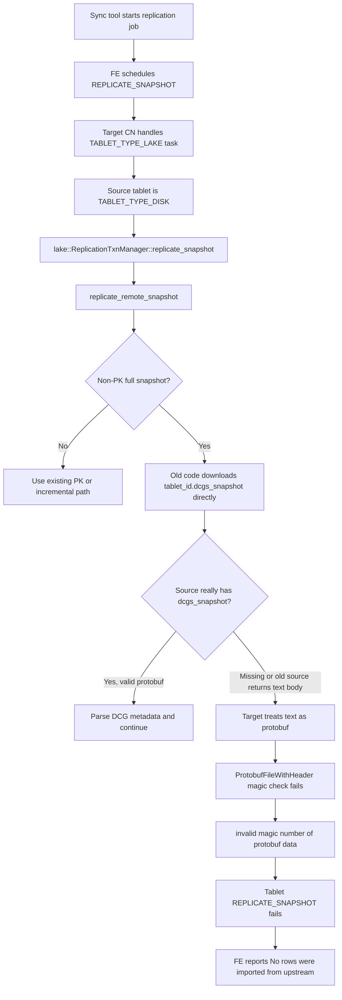
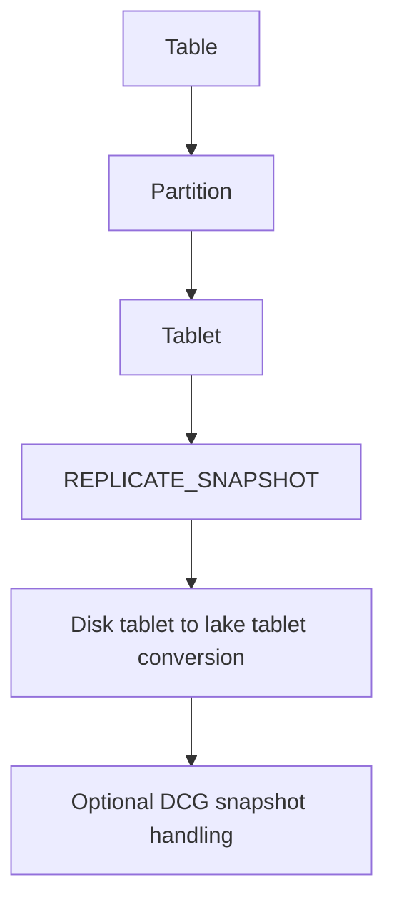
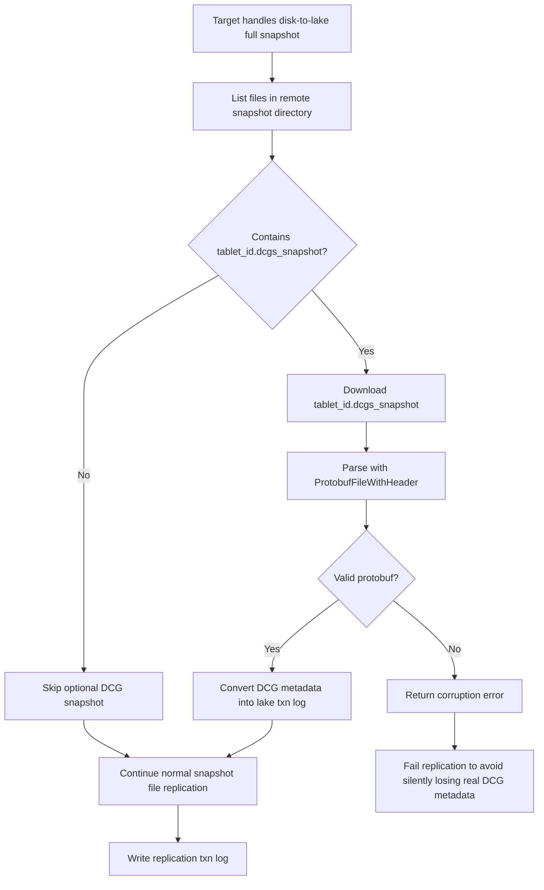

# Disk-to-Lake Replication DCG Snapshot Compatibility

## Background

This document records a disk-to-lake replication failure found during OPPO
StarRocks 4.1.1 data synchronization.

Observed job:

- Job: `1788424789391-0`
- Label: `REPLICATION_11106_698127_1788424789391-0`
- Stage: `REPLICATE_SNAPSHOT`
- Source tablet type: `TABLET_TYPE_DISK`
- Target tablet type: `TABLET_TYPE_LAKE`
- Visible symptom from the sync tool: `No rows were imported from upstream`
- Root BE error: `invalid magic number of protobuf data`

The sync tool only reported the generic load failure because FE wraps the lower
level tablet replication error when `empty_load_as_error=true`.

## What Is DCG

DCG means `Delta Column Group`. It stores metadata for column-level delta files
produced by partial column updates. During snapshot replication, these metadata
entries tell the target tablet which extra column files must be copied and how
they should be attached to the target tablet metadata.

For shared-nothing non-primary-key tablets, DCG metadata can be exported as:

```text
<tablet_id>.dcgs_snapshot
```

The file is expected to be a `DeltaColumnGroupSnapshotPB` serialized with
`ProtobufFileWithHeader`, which means the payload must start with the StarRocks
protobuf file magic header.

## Failure Flow



## Root Cause

The target-side lake replication code tried to download the optional
`.dcgs_snapshot` file directly for non-primary-key full snapshots.

The intended behavior was:

1. If the source snapshot has `<tablet_id>.dcgs_snapshot`, download and parse it.
2. If the file does not exist, treat it as optional and continue.

However, old source BE versions or some HTTP error paths can return a small text
response body instead of a protobuf file. The target side then receives a
successful download result and calls:

```text
ProtobufFileWithHeader::load(...)
```

Because the response body is not a `ProtobufFileWithHeader` file, the magic
header check fails with:

```text
invalid magic number of protobuf data
```

The FE config `enable_legacy_compatibility_for_replication` does not fix this
case. In the current code, that switch is only used by FE column definition
compatibility logic. It does not affect BE snapshot download or DCG protobuf
parsing.

## Why Partitioned Tables Are Also Affected

This is a tablet-level problem, not a table-level or partition-level problem.



A partitioned table contains tablets under each partition. If any tablet enters
the same disk-to-lake full snapshot path, it can hit the same `.dcgs_snapshot`
compatibility issue.

## Fix

The fix changes the target-side behavior from "download first, then decide" to
"list first, then download only when present".



Changed files:

- `be/src/storage/replication_utils.h`
- `be/src/storage/replication_utils.cpp`
- `be/src/storage/lake/replication_txn_manager.cpp`
- `be/test/storage/lake/replication_txn_manager_test.cpp`

Implementation details:

- Added `ReplicationUtils::list_remote_snapshot_files(...)`.
- In production, it uses the same remote snapshot directory HTTP endpoint as
  normal snapshot file download.
- In BE tests, it lists the local snapshot directory directly.
- `lake::ReplicationTxnManager::replicate_remote_snapshot(...)` now checks
  whether `<src_tablet_id>.dcgs_snapshot` exists in the remote snapshot file
  list before downloading it.
- If the file is absent, the target logs and skips DCG metadata conversion.
- If the file is present but cannot be parsed as protobuf, the replication still
  fails. This protects tables that really have DCG metadata from silent metadata
  loss.

## Regression Test

Added test:

```text
LakeReplicationTxnManagerTest.test_full_non_pk_skips_missing_dcg_snapshot
```

The test simulates an old source cluster:

1. Create a full snapshot for a non-primary-key disk tablet.
2. Remove the generated `<tablet_id>.dcgs_snapshot` file.
3. Run disk-to-lake `replicate_snapshot`.
4. Verify replication succeeds.
5. Verify the generated replication txn log does not contain DCG metadata.

Existing tests still cover:

- Incremental non-PK snapshot skips `.dcgs_snapshot`.
- Full non-PK snapshot with an empty `.dcgs_snapshot` still succeeds.
- Present but invalid DCG metadata is not silently ignored.

## Validation

Local checks performed:

```bash
git diff --check -- \
  be/src/storage/replication_utils.h \
  be/src/storage/replication_utils.cpp \
  be/src/storage/lake/replication_txn_manager.cpp \
  be/test/storage/lake/replication_txn_manager_test.cpp
```

Result: passed.

IDE diagnostics for the changed files: no new linter errors.

Focused BE UT command attempted:

```bash
./run-be-ut.sh --test LakeReplicationTxnManagerTest --enable-shared-data -j 8
```

The test did not start because the local environment has GCC `11.4.0`, while
the script requires GCC `>= 12.1.0`.

## Operational Expectation

After deploying the fixed BE/CN binary, the same tablet-level fix applies to
both partitioned and non-partitioned tables.

The fix should resolve failures whose root BE error is:

```text
invalid magic number of protobuf data
```

on the disk-to-lake non-primary-key full snapshot DCG path.

If a retry fails with a different lower-level error, investigate the new BE log.
Possible next-layer issues include schema incompatibility, segment file download
failure, delete vector compatibility, primary-key encoding compatibility, or
storage access errors.
